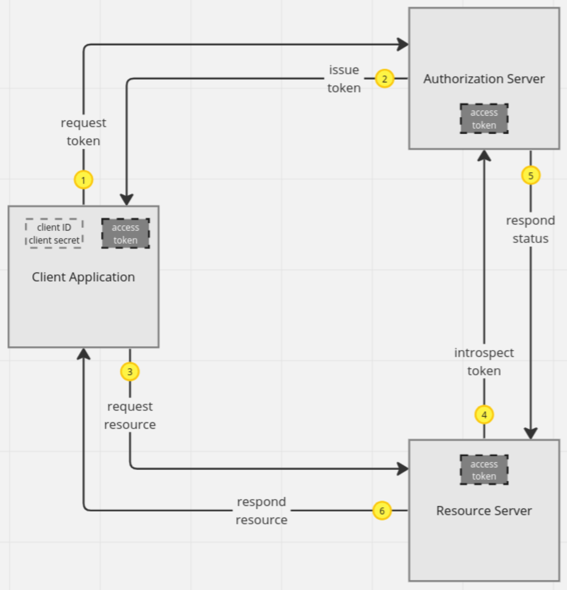

# OAuth 2.0 Client Credentials Flow

# Overview

The OAuth Client Credentials flow is designed for server-to-server authentication, where the client application needs 
to access resources it owns. This flow is suitable for clients that can securely store their client credentials 
(client ID and client secret). 


*Source: https://miro.com/app/board/uXjVNx0JOn8=/?share_link_id=616450828848*

Here's a step-by-step description of the process:

1. **Client Authentication**: 

To initiate the flow, the client authenticates with the authorization server using its client credentials 
(client ID and client secret) and requests an access token. This request is typically made to a specific endpoint 
(e.g., `/token`) of the authorization server.

2. **Access Token Issuance**: 

If the client is successfully authenticated, the authorization server issues an access token. The access token is a 
string representing the authorization granted to the client. The response from the authorization server typically 
includes the access token itself, the type of token, the lifetime of the token (expires_in), and the granted scopes 
(if applicable).

3. **Access Resource Server**: 

The client uses the access token to make authenticated requests to the resource server. The access token is included 
in the HTTP headers of the request, typically as a Bearer token.

4. **Resource Server Token Validation**: 

Upon receiving an access token, the resource server must validate it before serving the request. The validation process 
involves:

- **Token Type Verification**: Confirming that the token type is as expected (e.g., Bearer).
- **Token Signature Verification**: If the token is a JWT (JSON Web Token), the resource server checks the signature 
- against the public key of the authorization server to ensure it was indeed issued by the authorization server and has 
- not been tampered with.
- **Token Expiry Check**: Ensuring the token has not expired based on the "exp" claim in a JWT or other token-specific 
- expiration information.
- **Scope Verification**: If applicable, verifying that the token has the necessary scopes for the requested resource.

5. **Resource Access**: 

If the token is valid, the resource server grants access to the requested resource.

6. **Error Handling**: 

If the token is invalid or expired, the resource server returns an error response, typically with a 401 Unauthorized 
status code, indicating that the client's request cannot be processed until it obtains a new access token.

## Resource Server

1. Add Maven dependencies:
    
```xml
    <dependency>
        <groupId>org.springframework.boot</groupId>
        <artifactId>spring-boot-starter-security</artifactId>
    </dependency>
    <dependency>
        <groupId>org.springframework.boot</groupId>
        <artifactId>spring-boot-starter-oauth2-resource-server</artifactId>
    </dependency>
```
This marks the Spring Boot application as a resource server and enables OAuth 2.0 support.

2. Configure the application properties:

```properties
# Path to the authorization server issuer URI to discover the provider configuration.
spring.security.oauth2.resourceserver.jwt.issuer-uri=https://integ.dynv6.net/keycloak/realms/oauth2-framework
```
This property tells the resource server where to find the public key to validate the JWT tokens issued by the 
authorization server.

3. Implement the REST controller:
```java
@RestController
@RequestMapping("/items")
public class ItemsController {

    @GetMapping
    public ResponseEntity<List<Item>> getItems() {

        List<Item> items = List.of(
            new Item("Item 1", "Description 1"),
            new Item("Item 2", "Description 2"),
            new Item("Item 3", "Description 3")
        );
        return ResponseEntity.ok(items);
    }

}
```
That's it. All the magic is done by Spring Boot and Spring Security. The `@GetMapping` method is secured by default.

## Testing
To test the resource server endpoint, an access token needs to be obtained from the authorization server 
(here Keycloak). Afterward, the access token is sent to the resource server within a bearer token by the 
*Authorization* header. 

From the authorization server, the client credentials (client ID and client secret) are provided.  

1. Obtain an access token:

```shell
curl --location 'https://integ.dynv6.net/keycloak/realms/oauth2-framework/protocol/openid-connect/token' \
--header 'Content-Type: application/x-www-form-urlencoded' \
--header 'Authorization: Basic <CLIENT_CREDENTIALS>' \
--data-urlencode 'grant_type=client_credentials'
```
An access token is returned in the response body.

2. Access the resource server:

```shell
curl --location 'http://localhost:18082/api/items' \
--header 'Authorization: Bearer <ACCESS_TOKEN>'
```
This calls the API method and returns the response body. In case of an invalid or expired token, a 401 Unauthorized is
returned.
